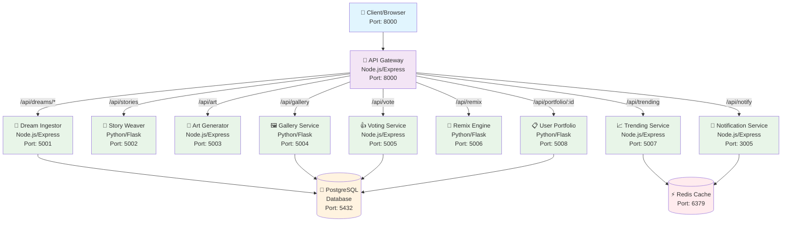

# DreamCanvas Architecture Diagram

## System Overview
DreamCanvas is a microservices-based application for dream management, story generation, and content creation.

## Component Details

### 🚪 **API Gateway** (Port 8000)
- **Technology**: Node.js + Express
- **Role**: Single entry point, request routing, load balancing
- **Routes**:
  - `/api/dreams/*` → Dream Ingestor
  - `/api/stories` → Story Weaver  
  - `/api/art` → Art Generator
  - `/api/gallery` → Gallery Service
  - `/api/vote` → Voting Service
  - `/api/remix` → Remix Engine
  - `/api/trending` → Trending Service
  - `/api/portfolio/:id` → User Portfolio
  - `/api/notify` → Notification Service

### 💭 **Dream Ingestor** (Port 5001)
- **Technology**: Node.js + Express + PostgreSQL
- **Purpose**: Store and retrieve dream entries
- **Endpoints**: 
  - `POST /dreams` - Create new dream
  - `GET /dreams` - List all dreams
  - `GET /dreams/:id` - Get specific dream

### 📖 **Story Weaver** (Port 5002)
- **Technology**: Python + Flask
- **Purpose**: Generate stories from dreams
- **Endpoints**: `GET /generate` - Generate dream story

### 🎨 **Art Generator** (Port 5003)
- **Technology**: Node.js + Express
- **Purpose**: Create visual art from dreams
- **Endpoints**: `GET /generate` - Generate dream art

### 🖼️ **Gallery Service** (Port 5004)
- **Technology**: Python + Flask + PostgreSQL
- **Purpose**: Display and manage dream gallery
- **Endpoints**: `GET /all` - Get gallery items

### 👍 **Voting Service** (Port 5005)
- **Technology**: Node.js + Express + PostgreSQL
- **Purpose**: Handle likes/votes for dreams
- **Endpoints**: `POST /like/:id` - Like a dream

### 🔄 **Remix Engine** (Port 5006)
- **Technology**: Python + Flask
- **Purpose**: Remix and transform existing dreams
- **Endpoints**: `POST /remix/:id` - Remix a dream

### 📈 **Trending Service** (Port 5007)
- **Technology**: Node.js + Express + Redis
- **Purpose**: Track and display trending dreams
- **Endpoints**: `GET /trending` - Get trending data

### 📋 **User Portfolio** (Port 5008)
- **Technology**: Python + Flask + PostgreSQL
- **Purpose**: Manage user's personal dream collections
- **Endpoints**: `GET /user/:id/dreams` - Get user's dreams

### 📢 **Notification Service** (Port 3005)
- **Technology**: Node.js + Express + Redis
- **Purpose**: Send notifications and alerts
- **Endpoints**: `GET /notify` - Send notifications

## Data Flow

1. **Client Request** → API Gateway (Port 8000)
2. **API Gateway** → Routes to appropriate microservice
3. **Microservice** → Processes request
4. **Database/Cache** ← Microservice (if data persistence needed)
5. **Microservice** → Returns response
6. **API Gateway** ← Receives response
7. **Client** ← API Gateway forwards response

## Technology Stack

| Component | Technology | Database | Port |
|-----------|------------|----------|------|
| API Gateway | Node.js + Express | - | 8000 |
| Dream Ingestor | Node.js + Express | PostgreSQL | 5001 |
| Story Weaver | Python + Flask | - | 5002 |
| Art Generator | Node.js + Express | - | 5003 |
| Gallery Service | Python + Flask | PostgreSQL | 5004 |
| Voting Service | Node.js + Express | PostgreSQL | 5005 |
| Remix Engine | Python + Flask | - | 5006 |
| Trending Service | Node.js + Express | Redis | 5007 |
| User Portfolio | Python + Flask | PostgreSQL | 5008 |
| Notification Service | Node.js + Express | Redis | 3005 |

## Network Architecture

- **Network**: `dreamcanvas-net` (Docker Bridge Network)
- **Database**: PostgreSQL (Persistent volume: `postgres_data`)
- **Cache**: Redis (In-memory)
- **Container Orchestration**: Docker Compose

## Security & Communication

- All services communicate within the Docker network
- API Gateway serves as the single public entry point
- Database credentials managed via environment variables
- Health checks implemented for database services
- Services restart automatically unless manually stopped